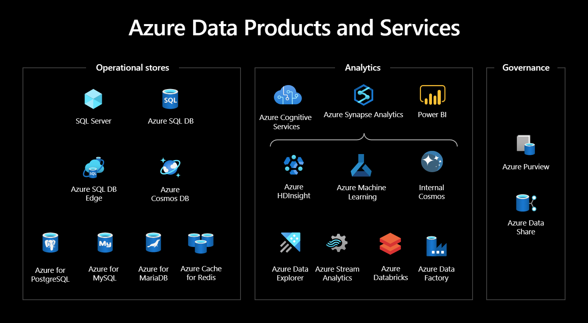
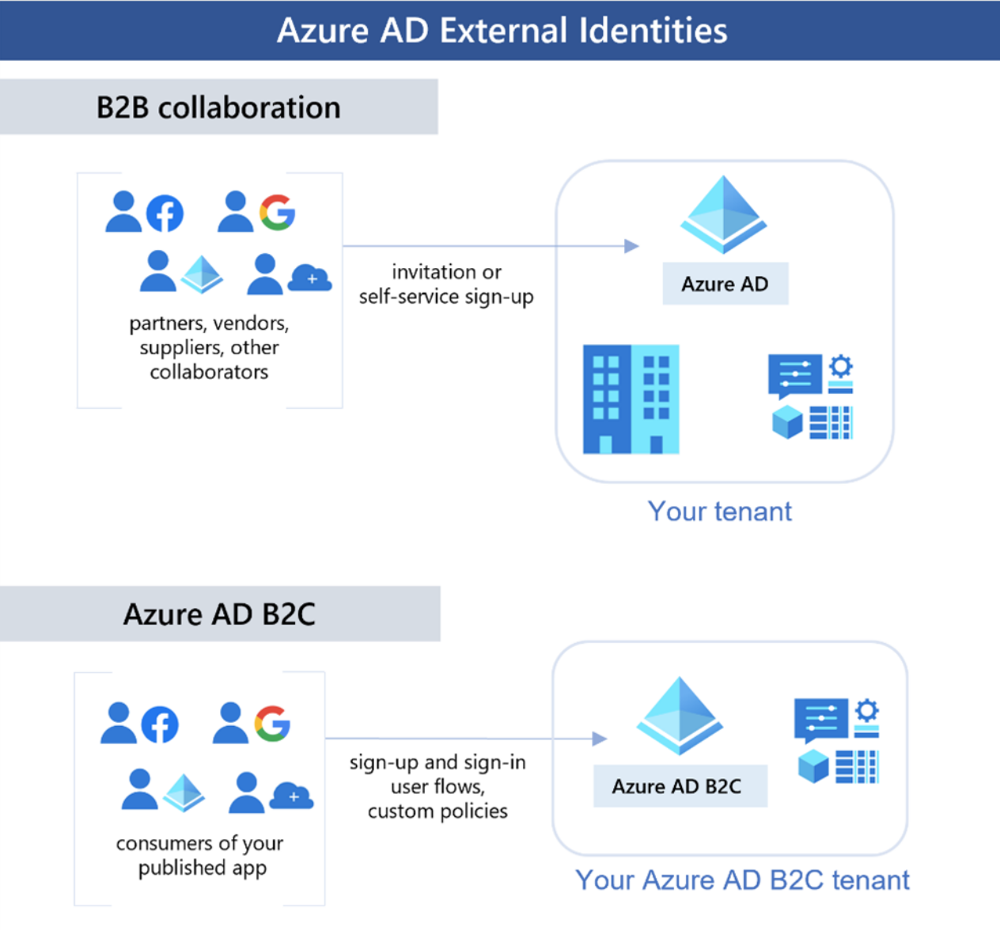

# Good evening again!

So lets start with:
1. Any questions, concerns or thoughts from our last lecture? 
2. So one from me, what did we talk about last time? 
3. And, what actually is Cloud?

Some quick terms to repeat:
1. Region
2. Availability Zone
3. Resource Group
4. Azure Portal

# Exams

Get an account here following the instructions on the website: https://learn.microsoft.com/en-us/certifications/student-training-and-certification
Verify yourself that you are a student: https://verify.microsoft.com/

# Let us start where we left off

  
Source: https://learn.microsoft.com/en-us/certifications/azure-fundamentals/

During this course we will be focusing mostly on these services: 

  

But first we need to learn how to manage the resources on our Azure platform. 

  
Source: https://learn.microsoft.com/en-us/certifications/azure-fundamentals/

So what do we have? 
1. Azure Portal - We already learned saw it in action.

2. Azure CLI - command-line tool that provides a way to manage resources on Azure using simple, intuitive commands. It's a good option if you prefer working in a terminal or need to automate resource management tasks. Good integration with other command line tools.  

Azure CLI:  

az group create --name SecondClass_RG --location eastus && \
az storage account create \
    --name secondclassstorage \
    --resource-group SecondClass_RG \
    --location eastus \
    --sku Standard_LRS \
    --kind BlobStorage \
    --access-tier Hot  

Easy to copy:
az group create --name SecondClass_RG --location eastus &&  az storage account create   --name secondclassstorage  --resource-group SecondClass_RG   --location eastus  --sku Standard_LRS  --kind BlobStorage  --access-tier Hot  

3. Azure PowerShell - PowerShell module that provides a set of cmdlets for managing Azure resources. It's a good option if you're comfortable with PowerShell and prefer to work in a scripting environment

4. Azure Resource Manager templates - ARMs are declarative JSON files that describe the infrastructure and configuration of Azure resources. Basic of many IaC for projects infrastructure. 

Repo of templates shared by the community: https://github.com/Azure/azure-quickstart-templates  

An example of how it is being used and how you can use it: https://github.com/samelhousseini/km-openai  

5. Terraform - popular open-source IaC tool that allows you to define, provision, and manage infrastructure resources across multiple cloud providers. 

How to start with it: https://learn.microsoft.com/en-us/azure/developer/terraform/get-started-azapi-resource  

The most important difference for me: Terraform automatically handles resource dependencies, while ARM requires you to define dependencies explicitly.

# Identity and Access

  
Source: https://learn.microsoft.com/en-us/certifications/azure-fundamentals/

You authenticate:
1. Password
2. Multifactor
3. Single Sign-on

External authenticate: 

  
Source: https://learn.microsoft.com/en-us/certifications/azure-fundamentals/

How do you get access to things? 

  
Source: https://learn.microsoft.com/en-us/certifications/azure-fundamentals/

Scopes include:

1. A management group (a collection of multiple subscriptions).
2. A single subscription.
3. A resource group.
4. A single resource

Azure RBAC is hierarchical, in that when you grant access at a parent scope, those permissions are inherited by all child scopes.

# Security

  
Source: https://learn.microsoft.com/en-us/certifications/azure-fundamentals/

And how does Azure care about the security when it comes to access? 

  
Source: https://learn.microsoft.com/en-us/certifications/azure-fundamentals/  

Different roles for Infra and Data roles!

Best practice for our application security:
1. Always use Azure Monitor, Application Insights to check the state of your solutions
2. Transfer logs to Azure Log Analytics for easier log exploration 
3. Secure your applications with virtual networks and NSGs
4. Manage access with IaM 
5. Secure your keys with Azure KeyVault

We will be touching on security for different service when we will get to them! 

# Networking

So what do we get out of the networking: https://azure.microsoft.com/en-us/products/category/networking/  

Virtual network generally:
  
Source: https://learn.microsoft.com/en-us/azure/networking/fundamentals/networking-overview  

OSI Model
 
Source: http://cisconetworkingbasics.blogspot.com/2013/06/the-osi-network-model-what-you-need-to.html  

# Pricing 

  

But how do i price my projects with all that? 
Well, pricing calculator for the rescue: https://azure.microsoft.com/en-us/pricing/calculator/  

# Exercise

Exercise: Create a Virtual Network and Secure Access to a Virtual Machine in Azure

Step 1: Create a Resource Group

1. Navigate to the Azure Portal and sign in with your credentials.
2. Click on "Resource groups" from the left-hand menu and click the "+ Add" button.
3. Fill in the required information, such as the resource group name, subscription, and region, then click "Create".

Step 2: Create a Virtual Network

1. Click on "Virtual networks" from the left-hand menu and click the "+ Add" button.
2. Fill in the required information, such as the virtual network name, address space, and subnet, then click "Create".
3. Once the virtual network is created, click on it to view its properties.
4. Under "Settings", click on "Subnets" and create a new subnet with the name "subnet-1" and an address range that is a subset of the virtual network address space.

Step 3: Create a Network Security Group

1. Click on "Network security groups" from the left-hand menu and click the "+ Add" button.
2. Fill in the required information, such as the security group name, resource group, and region, then click "Create".
3. Once the security group is created, click on it to view its properties.
4. Under "Settings", click on "Inbound security rules" and create a new rule that allows incoming SSH traffic from a specific IP address range.

Step 4: Create a Virtual Machine

1. Click on "Virtual machines" from the left-hand menu and click the "+ Add" button.
2. Fill in the required information, such as the virtual machine name, resource group, region, and image, then click "Review + create".
3. In the "Networking" tab, select the virtual network and subnet created in Step 2.
4. In the "Management" tab, select the "SSH (22)" option under "Inbound port rules".
5. In the "Advanced" tab, select the network security group created in Step 3 under "Network security group".

Step 5: Connect to the Virtual Machine

1. Once the virtual machine is created, click on it to view its properties.
2. Under "Settings", click on "Networking" and note down the public IP address.
3. Open a terminal or command prompt and connect to the virtual machine using SSH, specifying the public IP address and the username and password created during the virtual machine creation process.

Step 6: Assign a Role to a User or Group

1. Click on "Access control (IAM)" from the left-hand menu and click on the "+ Add" button in your VM.
2. Select "Add role assignment" and fill in the required information, such as the role, user or group, scope is already the resource you are on, your VM.
3. Click "Save" to assign the role to the selected user or group.

**Congratulations**, you have successfully created a virtual network, secured access to a virtual machine using a network security group, and connected to the virtual machine using SSH. This exercise covers networking, identity access, and security using Azure Portal and Azure CLI.

And now get me an ARM Template for that!

# Homework

Do it all with Azure CLI or Terraform. 
I would strongly recommend to check out Terraform if you are thinking about working with infrastructure for real in the future.

