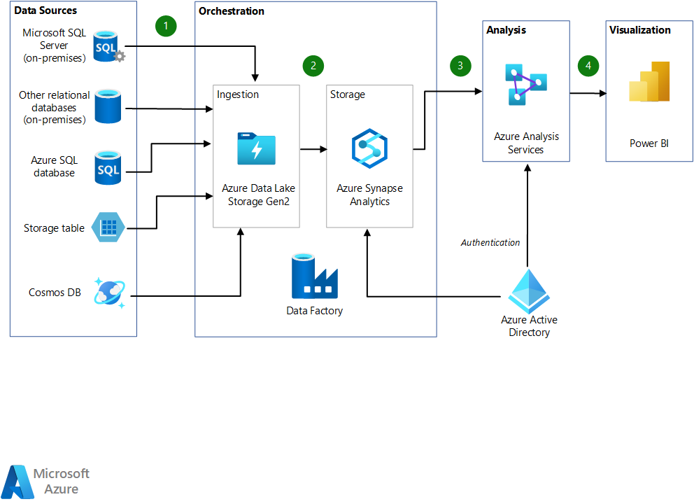

# Good evening again!

So lets start with:
1. Any questions, concerns or thoughts from our last lecture? Homework? 
2. So one from me, what did we talk about last time? 
3. And, what types of storage do we have in Azure?

Some quick terms to repeat:
1. ETL, ELT?
2. Data Warehouse?
3. Azure Data Factory - TLDR; Azure Data Factory is a cloud-based data integration service that allows you to create data-driven workflows in the cloud for orchestrating and automating data movement and data transformation.
4. Azure Synapse Analytics - TLDR; Azure Synapse Analytics is a limitless analytics service that brings together enterprise data warehousing and Big Data analytics. It gives you the freedom to query data on your terms, using either serverless on-demand or provisioned resources—at scale.

# Lake again!

  
Source: https://azure.microsoft.com/en-us/products/data-lake-analytics/  

But this we already know... 

  
Source: https://learn.microsoft.com/en-us/azure/architecture/example-scenario/data/data-warehouse  

But this we also know.. 

So what are other ways in which we can build a warehousing solution?   
And are they any better?  

# Lakehouse

A data lakehouse is a new, open data management architecture that combines the flexibility, cost-efficiency, and scale of data lakes with the data management and ACID transactions of data warehouses, enabling business intelligence (BI) and machine learning (ML) on all data.  
Source: https://www.databricks.com/glossary/data-lakehouse  

So how is it different from Modern Data Warehouse we've been discussing? 
(In simple terms) The moment when we move to no-rules to rules!  
And other things.. 

  
Source: https://www.databricks.com/glossary/data-lakehouse

The data lakehouse replaces the current dependency on data lakes and data warehouses for modern data companies that desire:

1. Open, direct access to data stored in standard data formats.
2. Indexing protocols optimized for machine learning and data science.
3. Low query latency and high reliability for BI and advanced analytics.
By combining an optimized metadata layer with validated data stored in standard formats in cloud object storage, the data lakehouse allows data scientists and ML engineers to build models from the same data driving BI reports.  
Source: https://learn.microsoft.com/en-us/azure/databricks/lakehouse/  

The solution that enables us to build a Data Lakehouse on Azure is Azure Databricks. 
Azure Databricks has two key components:
1. Delta tables - By storing data with Delta Lake, you enable downstream data scientists, analysts, and machine learning engineers to leverage the same production data supporting your core ETL workloads as soon as data is processed.
2. Unity Catalog - Unity Catalog ensures that you have complete control over who gains access to which data and provides a centralized mechanism for managing all data governance and access controls without needing to replicate your data.
Source: https://learn.microsoft.com/en-us/azure/databricks/lakehouse/  

# Delta

Delta Lake: https://delta.io/ - Delta Lake is an open-source storage framework that enables building a
Lakehouse architecture with compute engines including Spark, PrestoDB, Flink, Trino, and Hive and APIs for Scala, Java, Rust, Ruby, and Python.

  
Source: https://delta.io/  

  
Source: https://www.databricks.com/glossary/medallion-architecture  

A medallion architecture is a data design pattern used to logically organize data in a lakehouse, with the goal of incrementally and progressively improving the structure and quality of data as it flows through each layer of the architecture (from Bronze ⇒ Silver ⇒ Gold layer tables). Medallion architectures are sometimes also referred to as "multi-hop" architectures.  
Source: https://www.databricks.com/glossary/medallion-architecture  

** For Data Mesh Fans - The Medallion architecture is compatible with the concept of a data mesh. Bronze and silver tables can be joined together in a "one-to-many" fashion, meaning that the data in a single upstream table could be used to generate multiple downstream tables.  
Source: https://www.databricks.com/glossary/medallion-architecture  

So where does the rules come here? ACID where?  
Delta lake transaction log indeed.

The Delta Lake transaction log (also known as the DeltaLog) is an ordered record of every transaction that has ever been performed on a Delta Lake table since its inception.  

  
  
  
Source: https://www.databricks.com/blog/2019/08/21/diving-into-delta-lake-unpacking-the-transaction-log.html  

When a user creates a Delta Lake table, that table’s transaction log is automatically created in the _delta_log subdirectory. As he or she makes changes to that table, those changes are recorded as ordered, atomic commits in the transaction log.

These checkpoint files save the entire state of the table at a point in time - in native Parquet format that is quick and easy for Spark to read. This means that when a user queries a Delta Lake table, Spark can read the latest checkpoint file and then apply any changes recorded in the transaction log since that checkpoint was created.
Source: https://www.databricks.com/blog/2019/08/21/diving-into-delta-lake-unpacking-the-transaction-log.html  

Also important:
1. Time-travel
2. Vacuuming
3. Optimizing

Tables created on Azure Databricks use the Delta Lake protocol by default. When you create a new Delta table:
1. Metadata used to reference the table is added to the metastore in the declared schema or database.
2. Data and table metadata are saved to a directory in cloud object storage.

# Unity Catalog

So we have one part, here comes the second one - Unity Catalog. 

# Spark again! 

# Azure Databricks

Let us see the insides of Azure Databricks!

# Exercise 

For today we have some Databricks, Data Lakehouse and Delta going on.
Lets meet the DBX Academy: https://github.com/databricks-academy  

So for today:
1. Go to https://github.com/MicrosoftLearning/databricks-intro
2. Let the work begin! 

Or if you want to do some more advanced stuff:
1. DE3 and DE4 from Data Engineering part https://github.com/databricks-academy/data-engineering-with-databricks-english 
2. If you want you can start from DE1 where will be Intro to PySpark and also ELT in DBX. 

# Homework

Do some DBX Academy. Depends on what skills you want to have go to:
1. Data Engineering with DBX: https://github.com/databricks-academy/data-engineering-with-databricks-english  
2. MLOps and building models in DBX: https://github.com/databricks-academy/ml-in-production-english
3. Data analytics with SQL: https://github.com/databricks-academy/data-analysis-with-databricks-sql

