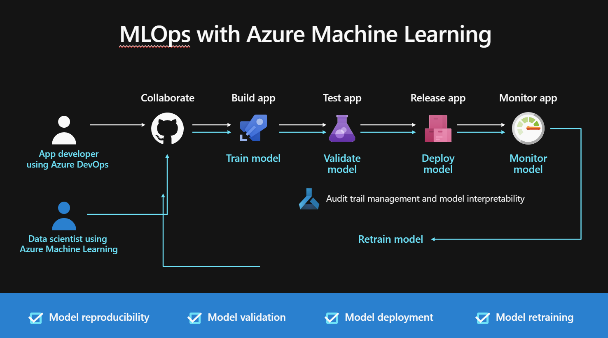

# Good evening again!

Important:
1. Teams Assignment (check if files could be uploaded)
2. Presentations - look at the guidelines! 
3. Evaluation Form - https://forms.office.com/r/cqgLbqGg64 - Please fill it in, it really means a lot to me whatever the content if honest. 

So lets start with:
1. Any questions, concerns or thoughts from our last lecture? Homework? 
2. So one from me, what did we talk about last time? 
3. And, what was the Lakehouse architecture?

Some quick terms to repeat:
1. Lakehouse - TLDR; a new, open data management architecture that combines the flexibility, cost-efficiency, and scale of data lakes with the data management and ACID transactions of data warehouses, enabling business intelligence (BI) and machine learning (ML) on all data.
2. Medalion architecture? 
3. Azure Databricks?

Today we're tying up the loose ends from the Data stack on Azure. 

# PowerBI 

Reporting is a very important part of the data stack. It is the way we communicate our findings to others. Usually, the business decision makers and other stakeholders. 

It is on the end of our data pipeline. 
We're back to our favourite architecture: https://learn.microsoft.com/en-us/azure/architecture/solution-ideas/articles/azure-databricks-modern-analytics-architecture

PowerBI is a business intelligence tool that allows you to create reports and dashboards from your data. It is a very powerful tool that allows you to create interactive reports and dashboards that can be shared with others. 

How we can use it? 

To get started with Power BI for free, you can follow these steps:

1. Go to the Power BI website: Visit the official Power BI website at https://powerbi.microsoft.com/ and click on the "Sign up free" button.
2. Sign in or create a Microsoft account: You will need a Microsoft account to use Power BI. If you already have one, sign in with your credentials. Otherwise, you can create a new account by clicking on the "Create one!" link.
3. Choose the free version: After signing in, you will be prompted to choose between the free and paid versions of Power BI. Select the "Start free" option.
4. Fill in the required information: Provide the necessary information, including your name, email address, country, and organization name (if applicable). Click on the "Next" button to proceed.
5. Agree to the terms: Read and accept the terms of service and privacy policy by checking the respective boxes. Then click on the "Sign up" button.
6. Verify your email address: Check your email inbox for a verification email from Power BI. Open the email and follow the instructions to verify your email address.
7. Complete the setup: Once your email address is verified, you will be directed to the Power BI service. Follow the on-screen prompts to complete the setup process, such as selecting your language and region preferences.
8. Explore Power BI: Now you can start using Power BI for free. You'll have access to a wide range of features, such as creating and sharing interactive reports and dashboards, connecting to various data sources, and exploring data insights.

# Azure Machine Learning

As we know, we need to train our models. We need to do this in a way that is scalable and reproducible.  

Azure ML is a cloud-based environment you can use to train, deploy, automate, manage, and track ML models. It is a fully managed service that enables you to: 
1. Prepare data from various Azure sources
2. Train models
3. Deploy models
4. Manage models
5. Track and monitor models
6. Monitor models
7. Re-train models (MLOps)

MLOps!  

# Cognitive Services 

So how does that look? 

# Azure OpenAI

# Azure Purview 

Azure Purview is a unified data governance service that helps you manage and govern your on-premises, multicloud, and software-as-a-service (SaaS) data. Easily create a holistic, up-to-date map of your data landscape with automated data discovery, sensitive data classification, and end-to-end data lineage. Empower data consumers to find valuable, trustworthy data.

# Exercise 

PowerBI:
1. The easy, smaller version (Build a report here): https://powerbi.microsoft.com/en-us/getting-started-with-power-bi/
2. The longer, more in depth version: https://powerbi.microsoft.com/en-gb/diad/ and here more intro: https://learn.microsoft.com/en-us/power-bi/learning-catalog/developer-online-course#self-study-kit

Azure ML:
1. The easy, smaller version: https://learn.microsoft.com/en-us/azure/machine-learning/tutorial-azure-ml-in-a-day?view=azureml-api-2
2. The longer, more in depth version: https://github.com/MicrosoftDocs/azure-docs/blob/main/articles/machine-learning/tutorial-azure-ml-in-a-day.md

Cognitive Services:
1. Test the APIs: https://github.com/Azure-Samples/cognitive-services-quickstart-code/tree/master/python
2. Choose the wanted solution and use the quickstart. Remember to create the resource first and use the API key and endpoint! 

Purview:
1. Go through the Purview intro: https://learn.microsoft.com/en-us/training/modules/intro-to-microsoft-purview/
2. Go through Quickstarts - you will learn how to create collection and data maps: https://learn.microsoft.com/en-us/azure/purview/create-microsoft-purview-portal
3. Check out how to use Purview on a whole big environment: https://github.com/tayganr/purviewdemo

# Homework

Get back to th exercises and learn about the services that interest you! 