# Good evening again!

So lets start with:
1. Any questions, concerns or thoughts from our last lecture? Homework? 
2. So one from me, what did we talk about last time? 
3. And, how Azure is secured?

Some quick terms to repeat:
1. RBAC - Role Based Access Control
2. VNet - Virtual Network
3. Best practices when securing your Azure resources (https://docs.microsoft.com/en-us/azure/security/fundamentals/best-practices-and-patterns)
4. Azure Pricing Calculator (https://azure.microsoft.com/en-us/pricing/calculator/)

# Data Strategy

So first let us talk about data in organizations. 
Why do we care so much? 

Reality:

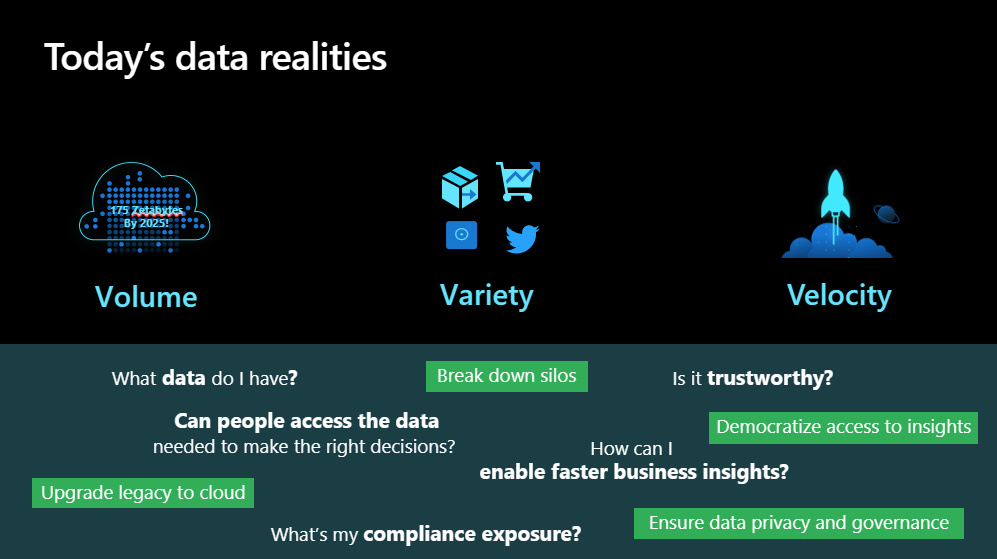

Expectations: 

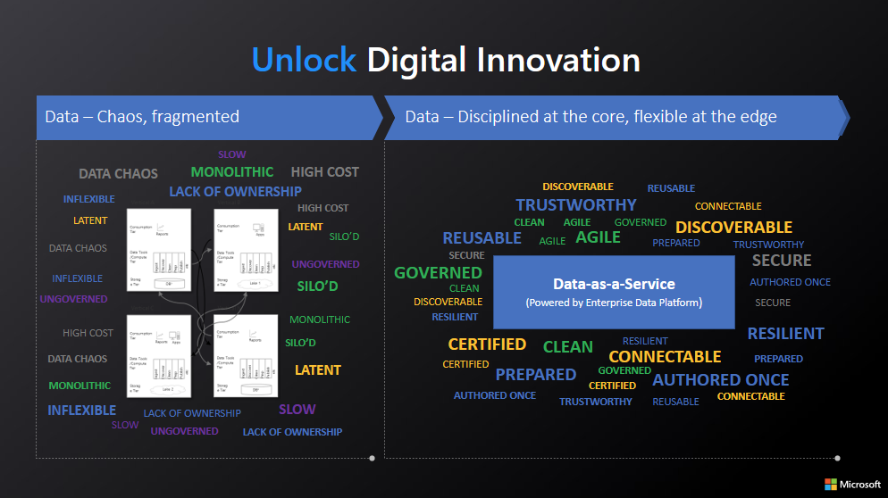

This is a strategy called a data-driven-organization.
We start with looking back, being able to look into the future: 

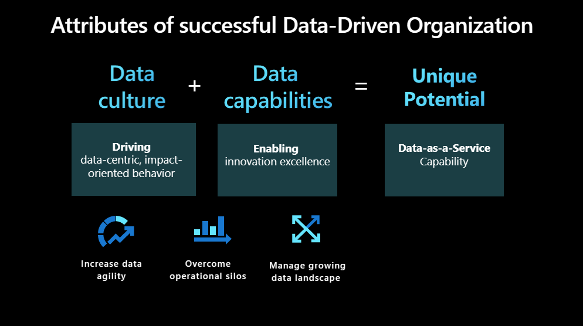

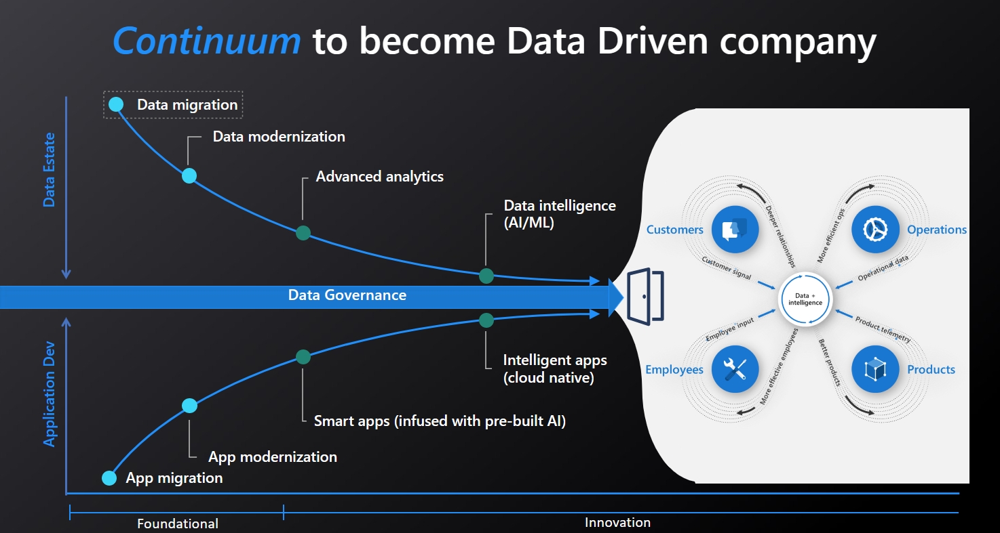

And how do we get there:

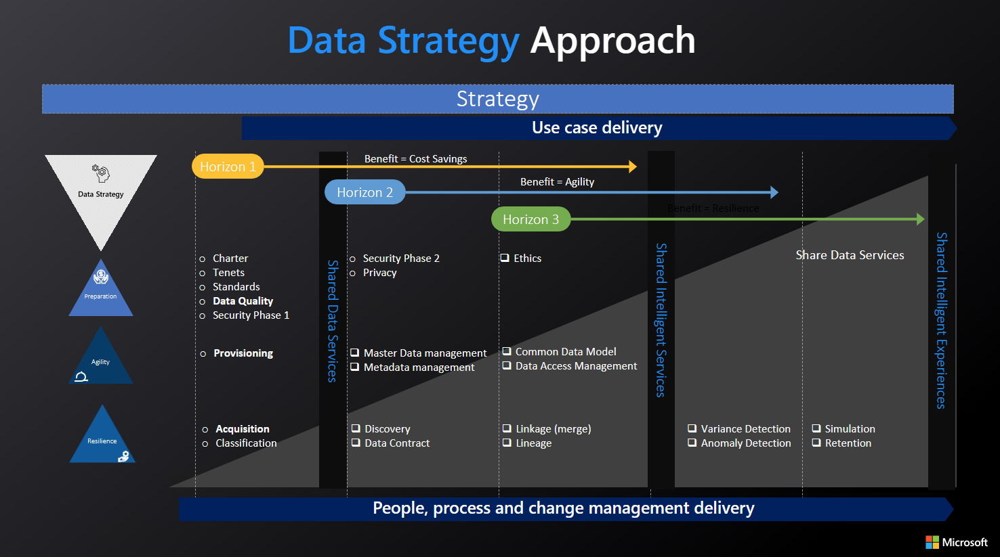

This is not easy.   
And never this beutiful and nice.  
But always - we aim for perfection dealing with blockers along the way.  

Usual problems:
1. Technology debt\ Legacy tools
2. Unskilled teams
3. Lack of unified data platform
4. Slim relathionship between Business and Tech
5. Dispartion of data sources
6. Lack of data governance
7. Unwillingness to change (old style leadership)
8. Prioritizing speed over quality

# Azure Data Services - Big Picture

So, as mentioned before, we will be talking about Azure Data Services today. 
All we talked about before - infrastructure is the base of data stack. 
There is no data without identity, security and access control. 

So we are here:
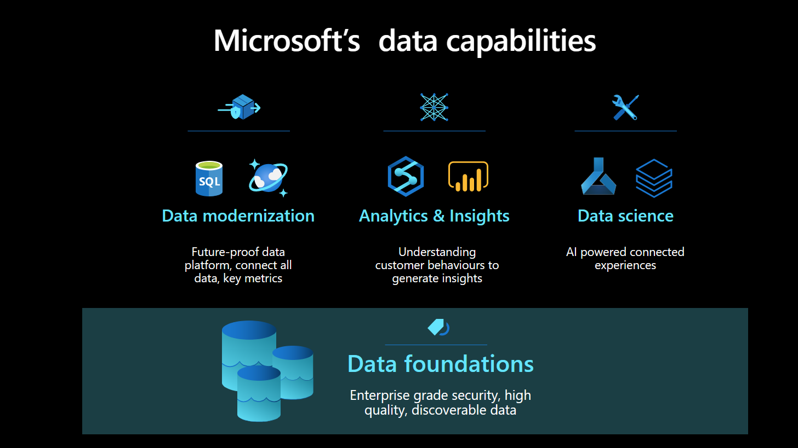

In detail:
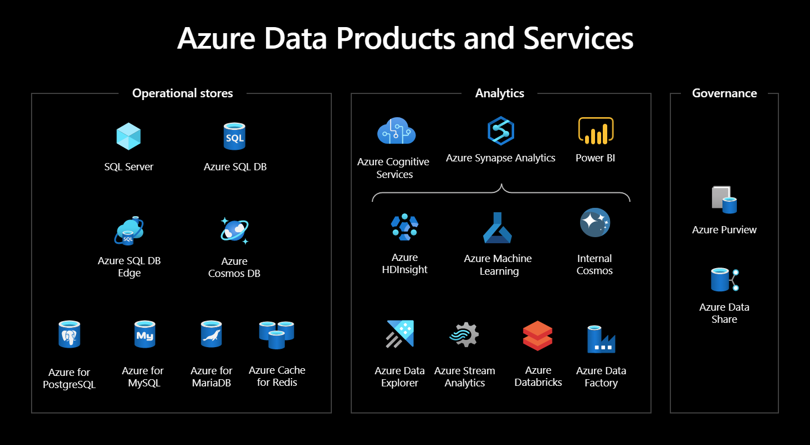

What exactly do we have here? What kind of services?  
What can we do with data on Azure?   

We start from the bottom up!
We will go from all the rules to none of the rules.

# Databases - YesSQL

SQL (Structured Query Language) is used for several reasons:

1. Efficient data retrieval: SQL is designed for efficient data retrieval and manipulation, making it a fast and responsive option for querying and analyzing data.

2. Scalability: SQL databases can handle large volumes of data and can scale up to support high-traffic applications.

3. Data integrity: SQL databases provide mechanisms for enforcing data integrity, such as constraints and data types, to ensure that data is accurate and consistent.

4. Data security: SQL databases can be secured with user authentication and authorization mechanisms, as well as data encryption and backups. This makes them a secure option for storing sensitive or confidential data.

5. Data consistency: SQL databases provide mechanisms for maintaining data consistency, such as transactions and locking, to ensure that data is not corrupted by concurrent operations.

6. Standardization: SQL is a widely accepted standard for relational databases, meaning that it is easy to find tools, libraries, and frameworks that support it. This makes it easier for developers and data scientists to work with SQL databases across different platforms and programming languages.

7. Ad hoc querying: SQL allows users to quickly and easily query data using simple commands, without the need for complex programming.

  
Source: https://codes.pratikkataria.com/acid-properties-of-transaction/

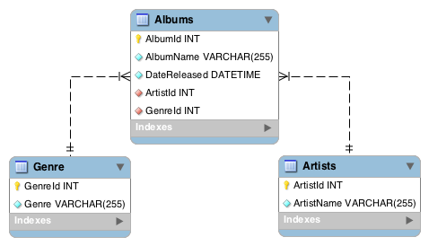  
Source: https://database.guide/what-is-a-database-schema/

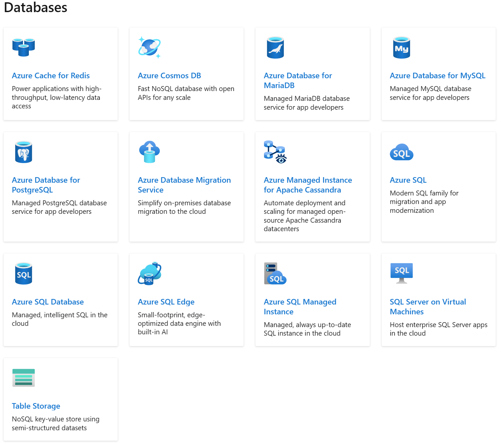  
Source: https://learn.microsoft.com/en-us/azure/?product=databases 

# Databases - NoSQL

So what is different:
1. Data model: SQL databases use a relational data model that stores data in tables with predefined columns and data types, while NoSQL databases use a variety of data models, such as key-value, document, or graph, that can be more flexible and adaptable to different types of data.

2. Schema: SQL databases use a schema to define the structure of the data in the database, while NoSQL databases often do not have a fixed schema, allowing for more flexibility in data modeling.

3. Transactions: SQL databases provide ACID-compliant transactions, which ensure that all database operations are atomic, consistent, isolated, and durable. While some NoSQL databases provide transactions, they often do not provide full ACID compliance.

4. Scalability: While SQL databases can be scaled vertically by adding more resources to a single server, NoSQL databases are often designed to be scaled horizontally across multiple servers, making it easier to handle large volumes of data and high traffic loads.

5. Performance: SQL databases are often optimized for complex queries that involve joins and aggregations, while NoSQL databases are often optimized for simple queries that involve data retrieval or modification based on a key

# Stores

Storage do not necessarily fit the traditional definition of a NoSQL databases, as they do not have the same data model or query capabilities. They are more flexible. 

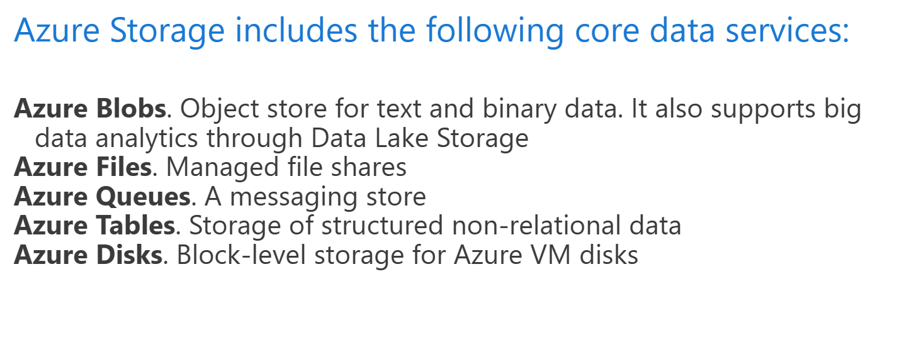

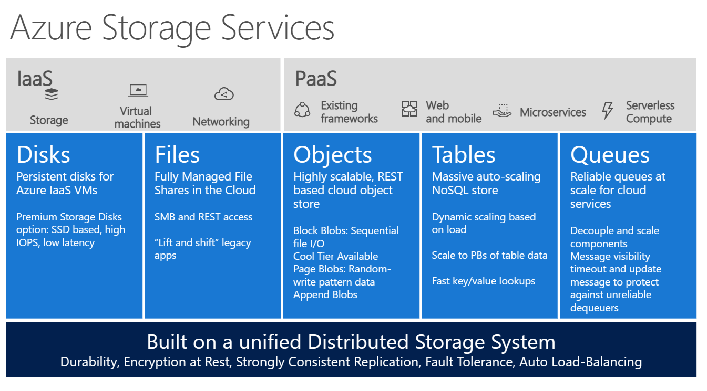

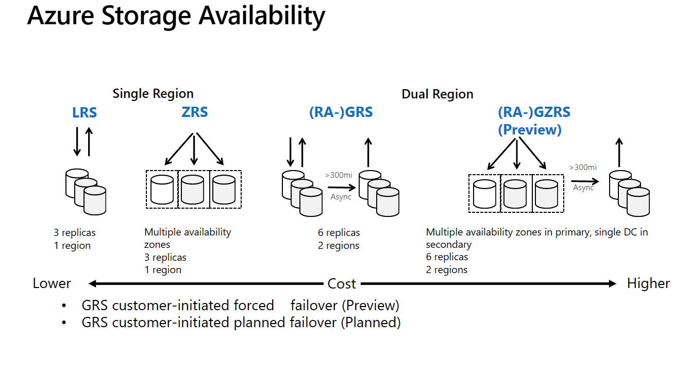

And what is this Data Lake all about?  

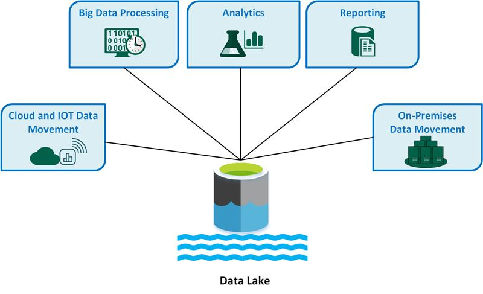  
Source: https://learn.microsoft.com/en-us/azure/architecture/data-guide/scenarios/data-lake

The hierarchical namespace is a key feature that enables Azure Data Lake Storage Gen2 to provide high-performance data access at object storage scale and price. You can use this feature to organize all the objects and files within your storage account into a hierarchy of directories and nested subdirectories.  
Source: https://learn.microsoft.com/en-us/azure/storage/blobs/data-lake-storage-introduction

Advantages of a data lake:

1. Data is never thrown away, because the data is stored in its raw format. This is especially useful in a big data environment, when you may not know in advance what insights are available from the data.
2. Users can explore the data and create their own queries.
3. May be faster than traditional ETL tools.
4. More flexible than a data warehouse, because it can store unstructured and semi-structured data.
Source: https://learn.microsoft.com/en-us/azure/architecture/data-guide/scenarios/data-lake  

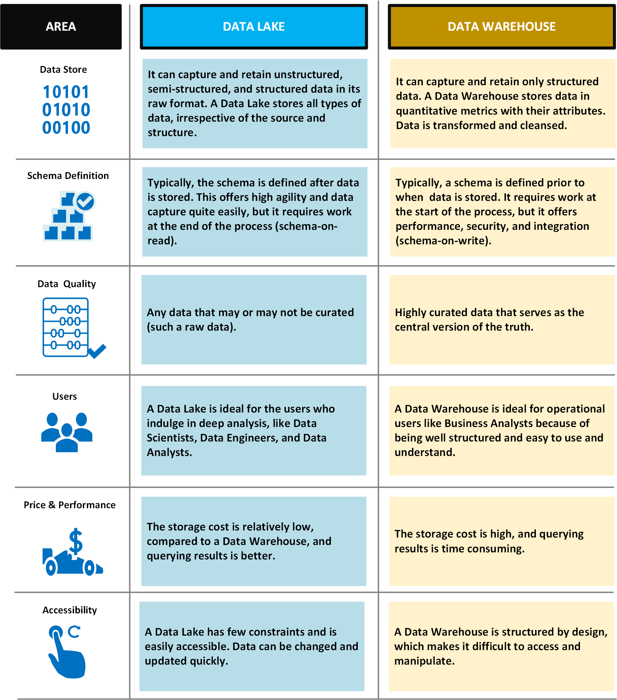  
Source: https://learn.microsoft.com/en-us/azure/architecture/data-guide/scenarios/data-lake  

Data Lake as a base for the modern data warehouse:  
https://learn.microsoft.com/en-us/azure/architecture/solution-ideas/articles/enterprise-data-warehouse  
https://learn.microsoft.com/en-us/azure/architecture/solution-ideas/articles/azure-databricks-modern-analytics-architecture  
https://learn.microsoft.com/en-us/azure/architecture/example-scenario/data/small-medium-data-warehouse  

# Serverless - Azure Functions

In a serverless architecture, applications are built using small, stateless functions that are triggered by specific events, such as a new file upload or a user request. Each function performs a specific task, and the functions can be combined and orchestrated to create a larger application or workflow.

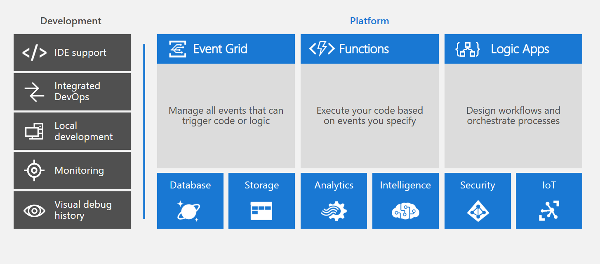

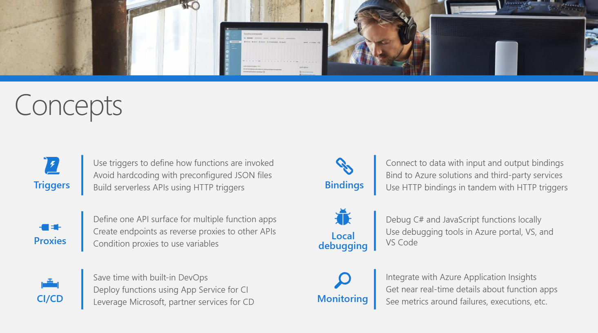

# Exercise

Let us start with creating a SQL Database in Azure, adding a schema, and uploading some data:

1. Log in to the Azure portal (https://portal.azure.com/).
2. Click on "Create a resource" and search for "SQL Database".
3. Click on "SQL Database" and then click on "Create".
4. Choose your subscription, resource group, and database name.
5. Select a server, or create a new one. If creating a new server, enter a unique server name, choose a region, and enter a username and password for the server admin.
6. Choose your pricing tier and configure the rest of the settings as desired.
7. Click "Review + create" to review your settings, and then click "Create" to create the database.
8. Once the database is created, navigate to it in the Azure portal.
9. Click on "Query editor" in the toolbar to open the SQL query editor.
10. In the query editor, create a new schema by running the following SQL query: 

CREATE SCHEMA UserSchema;  

11. Next, create a new table in the schema by running the following SQL query: 

CREATE TABLE UserSchema.UserTable (  
   Id INT PRIMARY KEY,  
   Name VARCHAR(50),  
   Age INT  
);  

12. Now, let's add some data to the table. You can do this by inserting rows into the table using the following SQL query:

INSERT INTO UserSchema.UserTable (Id, Name, Age)  
VALUES (1, 'John', 30),  
       (2, 'Jane', 28),  
       (3, 'Bob', 35);  

13. Once you have added data to the table, you can verify that it was inserted correctly by running a SELECT query:

SELECT * FROM UserSchema.UserTable;

You can always create a schema for your table after it has been created.  
If you want to come further into SQL journey, now create the table without a schema first and add it later. 

You can also learn SQL more for example in w3Schools: https://www.w3schools.com/sql/  

Now let us add some Serverless to this! We will create an Azure Function that can query our database: 

1. Log in to the Azure portal (https://portal.azure.com/).
2. Click on "Create a resource" and search for "Function App".
3. Click on "Function App" and then click on "Create".
4. Choose your subscription, resource group, and function app name.
5. Select a runtime stack. For this exercise, choose "JavaScript" as the language and "Windows" as the operating system.
6. Choose your hosting plan and configure the rest of the settings as desired.
7. Click "Review + create" to review your settings, and then click "Create" to create the function app.
8. Once the function app is created, navigate to it in the Azure portal.
9. Click on "Functions" in the sidebar and then click on the "+ New Function" button.
10. Choose "HTTP trigger" as the template for your function, and give it a name.
11. In the code editor, replace the existing code with the following JavaScript code:

const sql = require('mssql');  

module.exports = async function (context, req) {  
    try {  
        const pool = await sql.connect(process.env['SQLConnectionString']);  
        const result = await pool.request().query('SELECT * FROM UserSchema.UserTable');  
        context.res = {  
            body: result.recordset  
        };  
    } catch (err) {  
        context.log(err);  
        context.res = {  
            status: 500,  
            body: "Error querying the database"  
        };  
    }  
};  

12. Save the function code by clicking on the "Save" button.
13. To allow your function to connect to your SQL Database, you need to add a connection string to your function app. Go to "Configuration" in the sidebar and add a new application setting called "SQLConnectionString" with the connection string to your SQL Database.
14. Now, you can test your function by clicking on the "Test/Run" button in the code editor. You should see a response with the data from your SQL Database.
15. Click on the "Run" button in the function code editor to run the function. This will simulate an HTTP request to your function.
16. After the function finishes running, you should see a response in the "Output" tab of the function code editor. The response should contain the data from your SQL Database.

If you see the expected output, then your function is working correctly and can successfully query your SQL Database. If you encounter any errors, you can check the logs in the "Monitor" tab of the function app to debug the issue.

# Homework

Now we will work with Azure Blob Storage and Azure Functions.

Lets get a bit harder. If you can, use only these general instructions:
1. Create an Azure Blob Storage container to upload files to.
2. Create another Azure Blob Storage container to save the processed data to.
3. Create an Azure Function that gets triggered by a new file uploaded to the first container.
4. Process the data in the file using the Azure Function.
5. Save the result in the second container.
6. Test the function by uploading a file to the first container and verifying that the result is saved in the second container.

If you cannot, here is more detailed info:

1. Create an Azure Blob Storage container to upload files to.
- Go to the Azure portal and navigate to the Storage account created in the prerequisite.
- Click on the "Containers" under "Blob service" and create a new container.
- Choose the container name, public access level, and other settings as per your requirement.
- Click on "Create" to create the container.
2. Create another Azure Blob Storage container to save the processed data to.
- Follow the same steps as in step 1 to create another container in the same storage account.
3. Create an Azure Function that gets triggered by a new file uploaded to the first container.
- Create a new Function App in the Azure portal.
- In the Function App, click on "New Function" and choose "Blob trigger" as the template.
- Configure the trigger to watch the first container for new files.
- Write the code to process the data in the file and save the result in the second container.

Example C# code, performing our task is in [function-code.cs](function-code.cs) file. 

- Deploy the Function App.
4. Test the function by uploading a file to the first container and verifying that the result is saved in the second container.
- Upload a file to the first container.
- Verify that the processed data is saved in the second container.

**Voila!** You have created a serverless application that processes data in a file uploaded to a container in Azure Blob Storage.

