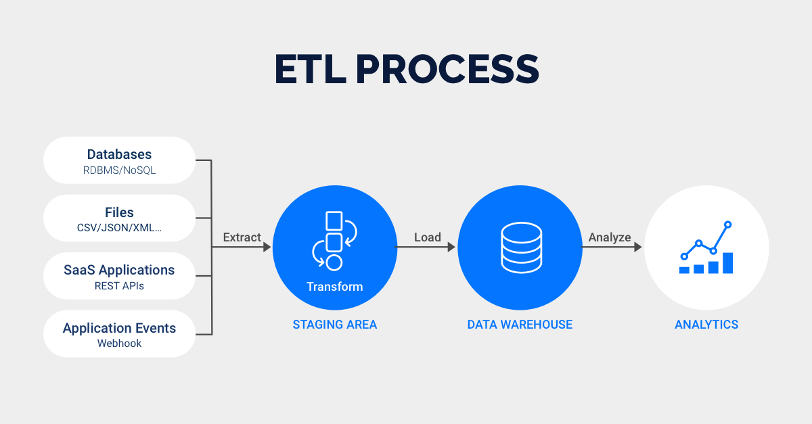
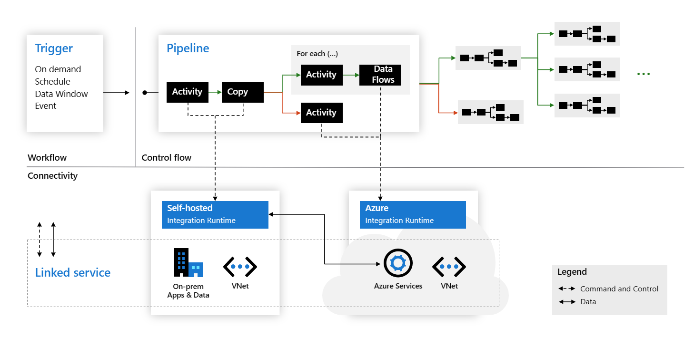
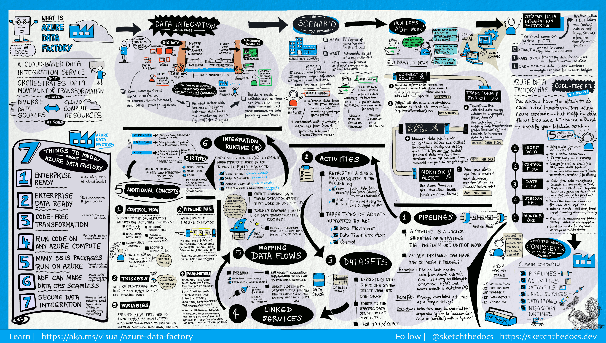
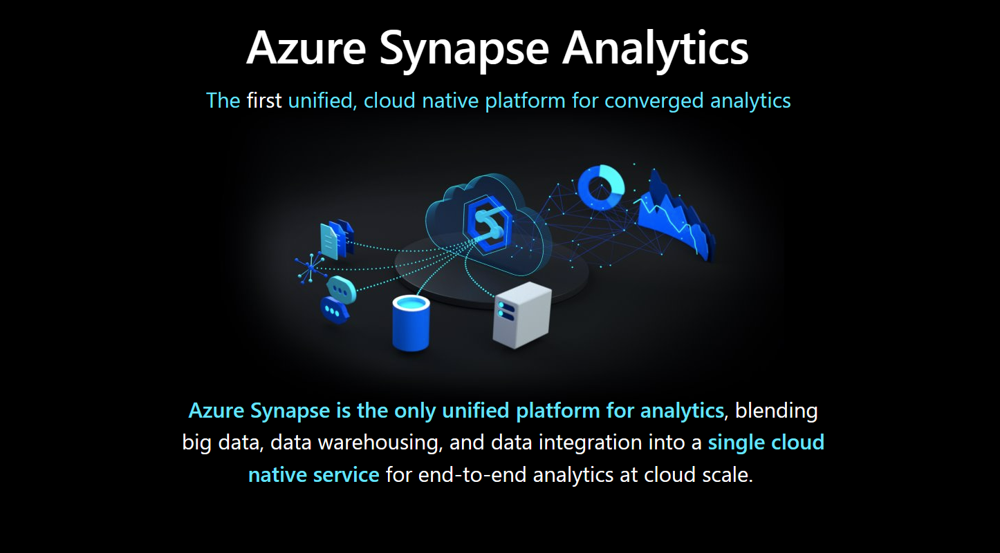

# Good evening again!

So lets start with:
1. Any questions, concerns or thoughts from our last lecture? Homework? 
2. So one from me, what did we talk about last time? 
3. And, what types of storage do we have in Azure?

Some quick terms to repeat:
1. NoSQL - Not only SQL
2. Azure Storage - Blob, Table, Queue, File
3. Azure Data Lake - TLDR; A data lake is a storage repository that holds a vast amount of raw data in its native format until it is needed. Data lakes are a key component of big data analytics, and they are used to store data of any type, size, and volume, and to prepare it for further.
4. Azure Functions - TLDR; Azure Functions is a serverless compute service that lets you run code on-demand without having to explicitly provision or manage infrastructure.

# ETL, ELT

1. ETL - Extract, Transform, Load
2. ELT - Extract, Load, Transform

You mean what? 

  

  
Source: https://medium.com/analytics-vidhya/introduction-data-driven-workflows-in-microsoft-azure-data-fatory-826f619842b3  

ETL:

1. Data is transformed into a common format before loading into a data warehouse
2. Transformation can involve cleaning, standardizing, and structuring the data
3. Useful when data from different sources needs to be transformed to a common format

ELT:

1. Data is loaded directly into the data warehouse without significant transformation
2. No source information is discarded, everything is being kept in the raw format to start with
3. Transformation happens within the data warehouse using tools such as SQL or data integration tools
4. Useful when the data is already in a common format or the data warehouse has powerful transformation capabilities

# Everything data loading - Azure Data Factory

It used to be the SSIS World. Now it is the ADF world.

We have already seen the architecture that look something like this:

  

Why ADF?

  

  

So what can we expect with ADF?

The main ones to remember here are:
1. Pipelines
2. Activities
3. Datasets
4. Linked Services
5. Data Flows
6. Integration Runtimes

I think all are clear except Integration Runtime. So what is it?

The Integration Runtime (IR) is the compute infrastructure used by Azure Data Factory and Azure Synapse pipelines to provide data integration capabilities across different network environments.  
Activity defines the action to be performed. A linked service defines a target data store or a compute service. An integration runtime provides the bridge between activities and linked services. It's referenced by the linked service or activity, and provides the compute environment where the activity is either run directly or dispatched. This allows the activity to be performed in the closest possible region to the target data store or compute service to maximize performance while also allowing flexibility to meet security and compliance requirements.
Source: https://learn.microsoft.com/en-us/azure/data-factory/concepts-integration-runtime  

Types of IRs:

https://learn.microsoft.com/en-us/azure/data-factory/concepts-integration-runtime  

Let us look how it looks in Azure!

# Azure Synapse Analytics - The modern Data Warehouse

The technological research and consulting firm Gartner defines four common types of analytical technique that organizations commonly use:

1. Descriptive analytics, which answers the question “What is happening in my business?”. The data to answer this question is typically answered through the creation of a data warehouse in which historical data is persisted in relational tables for multidimensional modeling and reporting.

2. Diagnostic analytics, which deals with answering the question “Why is it happening?”. This may involve exploring information that already exists in a data warehouse, but typically involves a wider search of your data estate to find more data to support this type of analysis.

3. Predictive analytics, which enables you to answer the question “What is likely to happen in the future based on previous trends and patterns?”

4. Prescriptive analytics, which enables autonomous decision making based on real-time or near real-time analysis of data, using predictive analytics.  
Source: https://learn.microsoft.com/en-us/training/modules/introduction-azure-synapse-analytics/

   
Source: https://learn.microsoft.com/en-us/training/modules/introduction-azure-synapse-analytics/

We already talked about some of the architectures of the modern data platform. How it used to look like:

    
Source: http://dataglass.blogspot.com/  

Remember - we used to be in the all-the-rules landscape. 

One or the other?  
  

Now we have scalable and secure (not only) SQL analytics platform:  
  

Back to architectures and where Synapse is now with the modern data warehouse:  
https://learn.microsoft.com/en-us/azure/architecture/solution-ideas/articles/enterprise-data-warehouse  
https://learn.microsoft.com/en-us/azure/architecture/solution-ideas/articles/azure-databricks-modern-analytics-architecture  
https://learn.microsoft.com/en-us/azure/architecture/example-scenario/data/small-medium-data-warehouse  

So what does it give us? 

  

  

So we can work with our data with various engines: 

  
  

Use cases:
1. Dala Lake exploration - You have data in the storage in form of files and uses client tools to explore the data to understand its shape and value by running interactive queries.
2. Data Lake Transformation - Customer has data in the storage in form of files and uses integration tools to transform the data into new optimized data sets. Tools issue queries on schedule or upon an event.​
3. Logical Datawarehouse - ata is in the storage in form of files and uses BI tools to visualize the data for various purposes. Tools issue queries when reports are refresh - either on schedule or on demand.​ 

So what about this spark? 

Apache Spark is a unified computing engine and a set of libraries for parallel data processing on computer clusters. As of the time of this writing, Spark is the most actively developed open source engine for this task; making it the de facto tool for any developer or data scientist interested in Big Data. Spark supports multiple widely used programming languages (Python, Java, Scala, and R), includes libraries for diverse tasks ranging from SQL to streaming and machine learning, and runs anywhere from a laptop to a cluster of thousands of servers. This makes it an easy system to start with and scale up to Big Data processing on an incredibly large scale.  
Source: https://towardsdatascience.com/a-beginners-guide-to-apache-spark-ff301cb4cd92  

  

 

Strong recommendation for all things Spark: https://www.youtube.com/@AdvancingAnalytics  
Intro to Synapse: https://www.youtube.com/watch?v=2DX7dgR8cEw  
Intro to Spark: https://www.youtube.com/watch?v=f8j5t_xaly4&list=PLHN2ijxAWBaMY4_1xMhOoeRWiZ6_d8F9s  

And back to Synapse overview now:  

And this one you would all surely like :DDD :  

Fun fact which is indeed important:   

The quick glance into Synapse Studio (what is there):  

And the exploration will be done in our exercise after the break <3

# Exercise 

We will be doing some Synapse today!  
Here we go...

If you want you can start with the whole Azure Synapse Challenge, which is set for 30 days:
1. Go to: https://learn.microsoft.com/en-us/training/challenges?id=3d6cb3b9-f4b7-4d7b-ab23-57faa1762705&wt.mc_id=AID3057766_QSG_SCL_636461
2. Begin the Challenge
3. If you finish the challenge in 30 days, you will get a 50% discout for one of the Data exams from Azure. Remember that Fundamentals exams you can do for free with the Instructions present in the markdown for the Second Class (05.04). But this discount will allow you to do the exams past the Fundamentals for 50% of the price and also learn Synapse. 

If you just want to do the task for today:  

1. Go to https://microsoftlearning.github.io/dp-203-azure-data-engineer/  
2. Go to Lab 1: Explore Azure Synapse Analytics
3. ✨ Work, work, work ✨

# Homework

Keep working with the Azure Synapse Challenge: https://learn.microsoft.com/en-us/training/challenges?id=3d6cb3b9-f4b7-4d7b-ab23-57faa1762705&wt.mc_id=AID3057766_QSG_SCL_636461 !!

