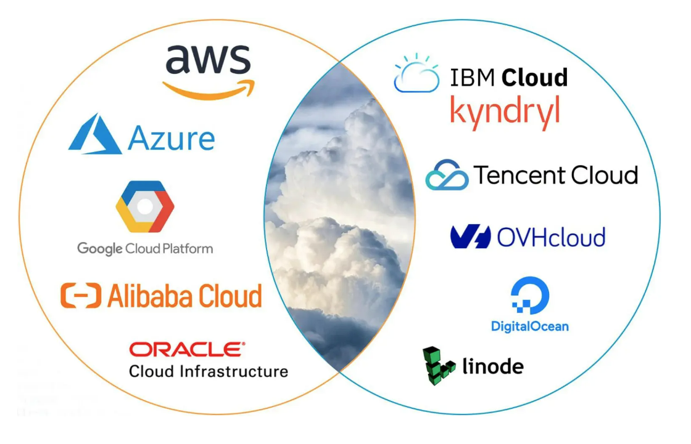
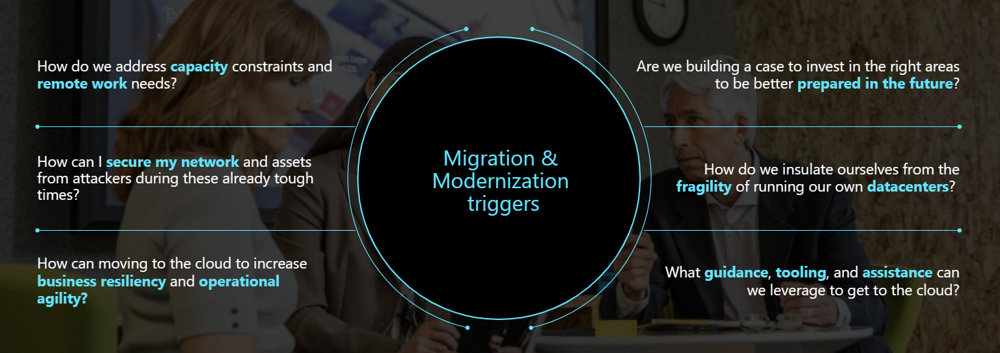
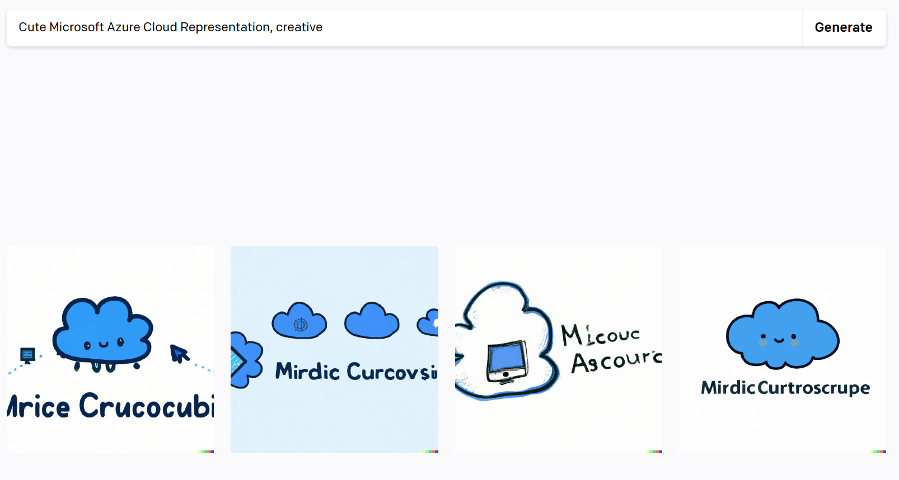
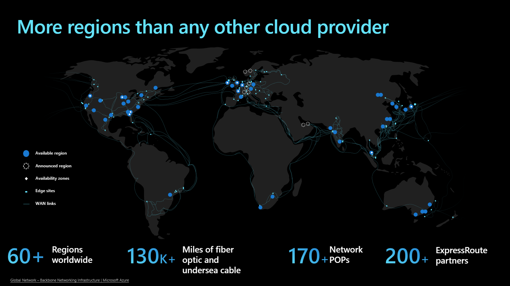
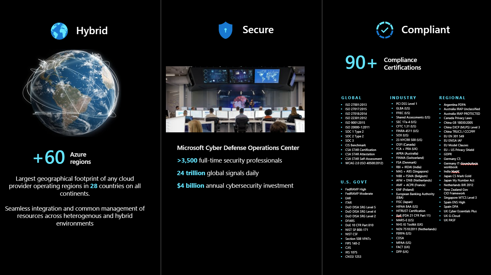
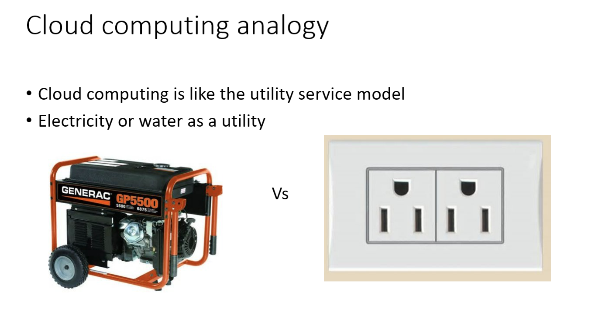
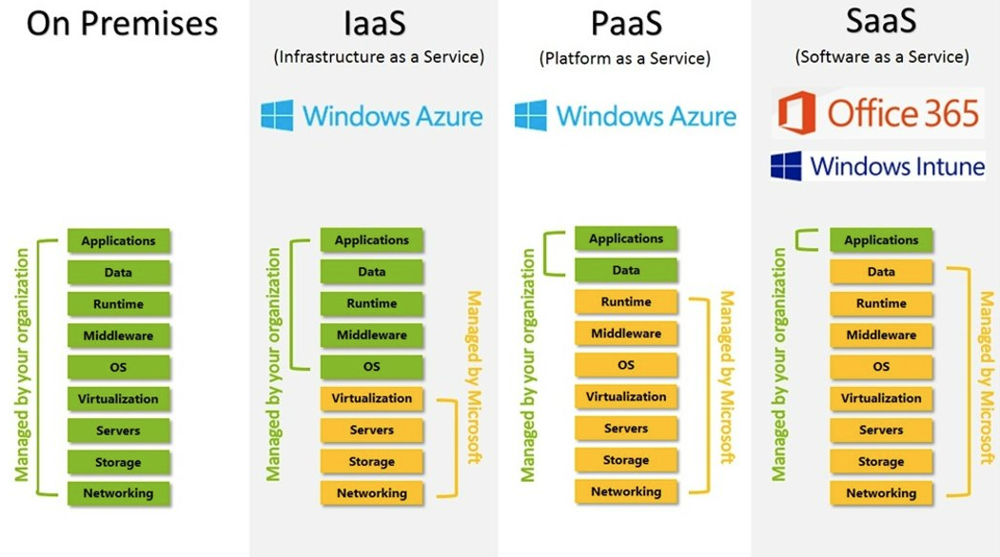
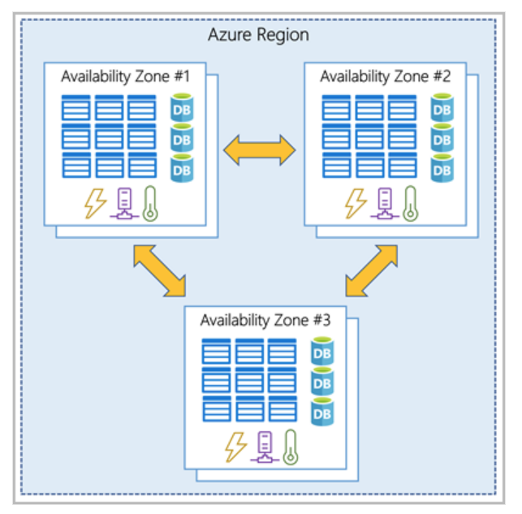
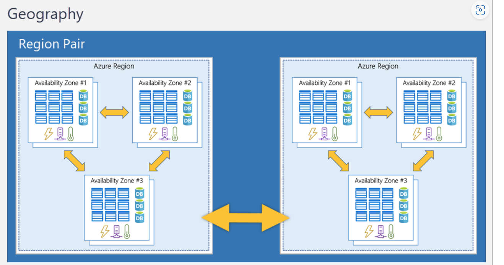

# Good evening

Hi all, my name is Pamela Krzypkowska and I will be teaching you about Deep Learning this semester. 
Some information about me:
1. I work as a Cloud Solution Architect specializing in AI @ Microsoft
2. I 💌 'Animal Crossing' and TikTok
3. I graduated Computer Science @ WUT and Philisophy @ UW

# What do you know about the Cloud? 

As a whole, the top 10 cloud service providers globally in 2023 are Amazon Web Services (AWS), Microsoft Azure, Google Cloud Platform (GCP), Alibaba Cloud, Oracle Cloud, IBM Cloud (Kyndryl), Tencent Cloud, OVHcloud, DigitalOcean, and Linode (owned by Akamai).
Source: https://dgtlinfra.com/top-10-cloud-service-providers-2022/

 
Source: https://dgtlinfra.com/top-10-cloud-service-providers-2022/

 

# What do you know about Azure? 

So let us talk more about Azure:  

What does Azure really bring to the table?

 

 

But what does that even mean? 

# Back to Cloud Computing

What is Cloud Computing?

1. Style of computing​
2. Delivering computing capabilities as a service​
3. Store data and run programs over the internet​
4. Use massive data centers for storage and compute​
5. Minimize maintenance overhead

How can we use the Cloud? 

What is down under? 

And what do those words mean? 

Region: 

A region is a geographical area on the planet that contains at least one, but potentially multiple datacenters that are nearby and networked together with a low-latency network. Azure intelligently assigns and controls the resources within each region to ensure workloads are appropriately balanced.

When you deploy a resource in Azure, you'll often need to choose the region where you want your resource deployed
Source: https://learn.microsoft.com/en-us/certifications/azure-fundamentals/

Availability Zone: 

Availability zones are physically separate datacenters within an Azure region. Each availability zone is made up of one or more datacenters equipped with independent power, cooling, and networking. An availability zone is set up to be an isolation boundary. If one zone goes down, the other continues working. Availability zones are connected through high-speed, private fiber-optic networks.

Source: https://learn.microsoft.com/en-us/certifications/azure-fundamentals/

Region pairs:

Making a pair for a region is made for high availability. This approach allows for the replication of resources across a geography that helps reduce the likelihood of interruptions because of events such as natural disasters, civil unrest, power outages, or physical network outages that affect an entire region. For example, if a region in a pair was affected by a natural disaster, services would automatically fail over to the other region in its region pair.

Source: https://learn.microsoft.com/en-us/certifications/azure-fundamentals/

# Let us use Azure!

What is the Azure free student account?
The Azure free student account offer includes:

1. Free access to certain Azure services for 12 months.
2. A credit to use in the first 12 months.
3. Free access to certain software developer tools.
4. The Azure free student account is an offer for students that gives $100 credit and free developer tools. Also, you can sign up without a credit card.
5. Get access: https://azure.microsoft.com/en-us/free/students/ 

